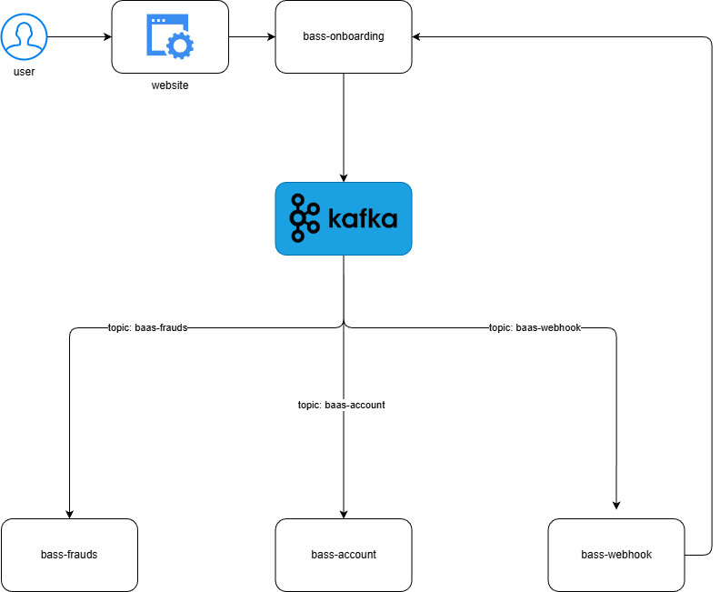

# 🏦 baas-onboarding

A case study of a **bank account onboarding** system, inspired by real-world BaaS (Banking as a Service) architecture. The project simulates an event-driven workflow that takes a customer from an initial HTTP request all the way to a fully provisioned bank account.

---

## 🏗️ Architecture



The onboarding flow is orchestrated through **Kafka** message passing across independent microservices. `baas-onboarding` is the entry point: it receives the customer data, generates an `onboarding_id`, persists it to **DynamoDB**, and publishes the first event to kick off the workflow.

Each downstream microservice consumes from its own Kafka topic, processes its step, and publishes the next message forward — carrying the current state.

### 🔄 Workflow

```
[HTTP POST /onboarding]
        │
        ▼
baas-onboarding (9001)
        │
        │ Kafka: baas-frauds
        ▼
baas-frauds (9002)
        │
        │ Kafka: baas-account
        ▼
baas-account (9003)
        │
        │ Kafka: baas-webhook
        ▼
baas-webhook (9004)
        │
        │ PATCH /onboarding/{id}/status
        ▼
baas-onboarding (status updated)
```

---

## 📦 Modules

| Module | Port | Description |
|---|---|---|
| `baas-onboarding` | 9001 | REST entry point — receives requests, persists state to DynamoDB, publishes to `baas-frauds` Kafka topic |
| `baas-frauds` | 9002 | Fraud detection — consumes `baas-frauds` topic, runs fraud checks, publishes to `baas-account` topic |
| `baas-account` | 9003 | Account provisioning — consumes `baas-account` topic, creates the account in DynamoDB, publishes to `baas-webhook` topic |
| `baas-webhook` | 9004 | Notification — consumes `baas-webhook` topic, sends notification, and calls `PATCH /onboarding/{id}/status` to finalize the flow |
| `baas-common` | — | Shared library — canonical message types, step enums, and `OnboardingEventPublisher` (Kafka) used by all microservices |

---

## 📨 Message Contract

Every event published to Kafka follows this structure:

```json
{
    "onboarding_id": "1234567890",
    "step": "FRAUD_CHECK",
    "next_steps": [
        "CUSTOMER_CREATION",
        "ACCOUNT_CREATION",
        "ACCOUNT_NOTIFICATION"
    ],
    "data": {
        "name": "John Doe",
        "email": "johndoe@domain.com",
        "phone": "1234567890",
        "document": "1234567890",
        "birth_date": "1990-01-01",
        "mother_name": "Jane Doe",
        "fingerprint": "base64_encoded_fingerprint",
        "address": {
            "street": "123 Main St",
            "city": "New York",
            "state": "NY",
            "zip": "12345"
        }
    },
    "metadata": {
        "fraud_check": {
            "status": "PENDING",
            "message": ""
        },
        "customer_creation": {
            "status": "PENDING",
            "message": ""
        },
        "account_creation": {
            "status": "PENDING",
            "message": ""
        },
        "error": {
            "code": "",
            "message": ""
        },
        "status": "IN_PROGRESS",
        "created_at": "2022-01-01T00:00:00Z",
        "updated_at": "2022-01-01T00:00:00Z"
    }
}
```

- **`step`** — the step currently being processed
- **`next_steps`** — remaining steps in the pipeline; each service pops the first one to know where to route next
- **`metadata`** — tracks the result of each step and the overall onboarding status (`IN_PROGRESS`, `COMPLETED`, `FAILED`)

---

## ⚙️ Tech Stack

- ☕ **Java 25** + **Spring Boot**
- 📨 **Apache Kafka** — event-driven communication between microservices
- 🗄️ **DynamoDB** — onboarding and account state persistence
- 🐳 **LocalStack** — local AWS emulation (DynamoDB) via Docker
- 🔍 **Jaeger** — distributed tracing (OpenTelemetry / OTLP)
- 📊 **Prometheus + Grafana** — metrics and dashboards

---

## 🚀 Running Locally

**1. Start infrastructure**

```bash
docker compose up -d
```

This starts:

| Service | URL |
|---|---|
| Kafka | `localhost:9092` |
| Kafka UI | `http://localhost:8080` |
| LocalStack (DynamoDB) | `http://localhost:4566` |
| Jaeger UI | `http://localhost:16686` |
| Prometheus | `http://localhost:9090` |
| Grafana | `http://localhost:3001` (admin/admin) |

The LocalStack init script at `localstack/init-scripts/init-aws.sh` automatically provisions the `Onboarding` DynamoDB table on startup.

> Wait a few seconds after starting before running the services — the init script runs asynchronously.

**2. Publish `baas-common` to Maven local**

Run once, or after any change to `baas-common`:

```bash
cd baas-common && ./gradlew publishToMavenLocal
```

**3. Run each service** _(separate terminals)_

```bash
cd baas-onboarding && ./gradlew bootRun   # port 9001
cd baas-frauds     && ./gradlew bootRun   # port 9002
cd baas-account    && ./gradlew bootRun   # port 9003
cd baas-webhook    && ./gradlew bootRun   # port 9004
```

Or use the convenience script from the repo root:

```bash
./start-all.sh
```

**End-to-end flow:** `POST /onboarding` → Kafka `baas-frauds` → `baas-frauds` → Kafka `baas-account` → `baas-account` → Kafka `baas-webhook` → `baas-webhook` → `PATCH /onboarding/{id}/status`.

---

## 🧪 Running Tests

```bash
cd baas-onboarding && ./gradlew test
cd baas-frauds     && ./gradlew test
cd baas-account    && ./gradlew test
cd baas-webhook    && ./gradlew test
```

---

## 🌐 API

### `POST /onboarding`
Creates a new onboarding process.

**Response** `201 Created`
```json
{ "onboarding_id": "..." }
```

### `GET /onboarding/{onboardingId}`
Returns the full onboarding record.

### `GET /onboarding/{onboardingId}/status`
Returns only the current status.

```json
{
    "onboarding_id": "...",
    "status": "IN_PROGRESS"
}
```

### `PATCH /onboarding/{onboardingId}/status`
Updates the onboarding status. Called internally by `baas-webhook` at the end of the workflow.

```json
{ "status": "COMPLETED" }
```

---

## 🔧 Using baas-common in a new microservice

1. Publish to Maven local (run once after any change):
   ```bash
   cd baas-common && ./gradlew publishToMavenLocal
   ```

2. Add to the microservice's `build.gradle`:
   ```groovy
   repositories { mavenLocal(); mavenCentral() }
   dependencies {
       implementation 'com.tapajos.baas:baas-common:0.0.1-SNAPSHOT'
   }
   ```

3. Configure in `application.yaml`:
   ```yaml
   baas:
     kafka:
       bootstrap-servers: localhost:9092
       consumer-topic: baas-<service-name>
       topic: baas-<next-service-name>
   ```

4. Inject and use:
   ```java
   @Autowired OnboardingEventPublisher publisher;

   OnboardingMessage next = OnboardingMessage.of(
       message.onboardingId(),
       OnboardingStep.FRAUD_CHECK,
       message.data(),
       metadata
   );
   publisher.publish(next);
   ```
   `OnboardingStep.nextSteps()` returns the remaining steps based on the current step's position in the workflow.
